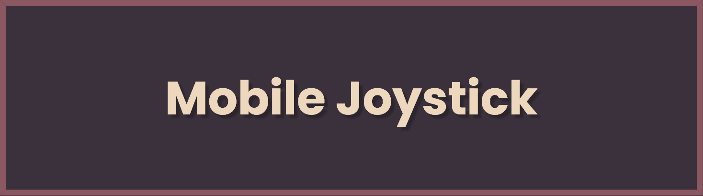
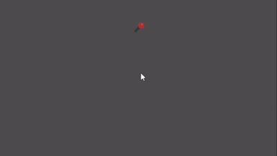
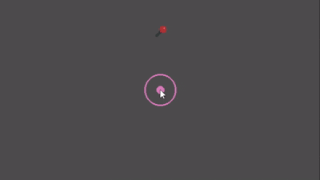

# Versatile Mobile Joystick for Godot



A highly customizable and easy-to-use virtual joystick plugin for Godot, perfect for mobile game development.

## Features

- **Simple to implement**: Easy integration into your Godot project.
- **Extremely customizable**: Adjust every aspect of the joystick to fit your game's needs.
- **Supports both fixed and dynamic positioning**: Choose how the joystick appears on screen.
- **Adjustable visibility modes**: Control when the joystick is visible.
- **Customizable input zones and responsiveness**: Fine-tune the joystick's behavior to enhance gameplay.

## Preview



## Quick Start

1. **Download** the plugin from the AssetLib.
2. **Alternatively, download the latest release and extract it into your project**
3. **Search for joystick.tscn**.
4. **Drag and drop on any scene you want**.
5. **Customize the joystick properties** in the Inspector panel.

## Configuration Options

Here are some of the key properties you can configure:

| Category          | Property            | Description                                                                 |
|-------------------|---------------------|-----------------------------------------------------------------------------|
| **Textures**      | `base_texture`      | The stationary part of the joystick.                                        |
|                   | `tip_texture`       | The movable part that follows touch input.                                  |
| **Behavior**      | `joystick_mode`     | `FIXED` (stationary) or `DYNAMIC` (appears at touch location).              |
|                   | `visibility_mode`   | `ALWAYS` visible or `WHEN_TOUCHED`.                                         |
|                   | `is_mobile_only`    | If enabled, the joystick will only work on mobile devices.                 |
| **Input Zones**   | `deadzone_circle`   | Central area where input is ignored.                                        |
|                   | `tip_limit_circle`  | Maximum range of joystick movement.                                         |
|                   | `touch_detection_region` | Area where touch input is detected.                             |
| **Response**      | `strength_curve`    | Customize input strength translation.                                       |
| **Mapping**       | `left_movement`     | Action name for leftward movement.                                          |
|                   | `right_movement`    | Action name for rightward movement.                                         |
|                   | `up_movement`       | Action name for upward movement.                                            |
|                   | `down_movement`     | Action name for downward movement.                                          |

## Recommended Project Settings

For optimal functionality, adjust the following settings in your Godot project:

- **"Emulate Touch from Mouse"**: ON
- **"Emulate Mouse from Touch"**: OFF

These settings ensure proper touch input handling, especially when testing on desktop environments.

## Usage Tips

- Add the joystick as a child of a **CanvasLayer** for proper rendering on top of other elements.
- Experiment with different **strength_curve** settings to find the right feel for your game.
- Use the **DYNAMIC** joystick_mode for more flexible controls in different game scenarios.
- Adjust the **deadzone_circle** to prevent unintended small movements.
- Customize the **touch_detection_region** to create larger or smaller interactive areas.
- Set **is_mobile_only** to *true* when joystick testing is done.

## Example Code

Here's a simple example of how to read input from the joystick in your game logic:

```gdscript
func _process(delta: float) -> void:
	direction = Input.get_vector("ui_left", "ui_right", "ui_up", "ui_down", 0)
	position += direction * speed * delta
```

## How to Contribute

We encourage contributions from the community! If you have ideas, bug fixes, or enhancements, please:

- **Submit issues** to report bugs or suggest features on our [GitHub repository](https://github.com/Wesley-Source/versatile-mobile-joystick).
- **Create pull requests** with your code changes. We appreciate:

  - **Clear commit messages** explaining your changes.

## Licensing Information

This project is released under the **MIT License**. For detailed license terms, please review the [LICENSE](LICENSE) file included in the repository.

---

**Inspired by MarcoFazioRandom own [Joystick](https://github.com/MarcoFazioRandom/Virtual-Joystick-Godot)**
